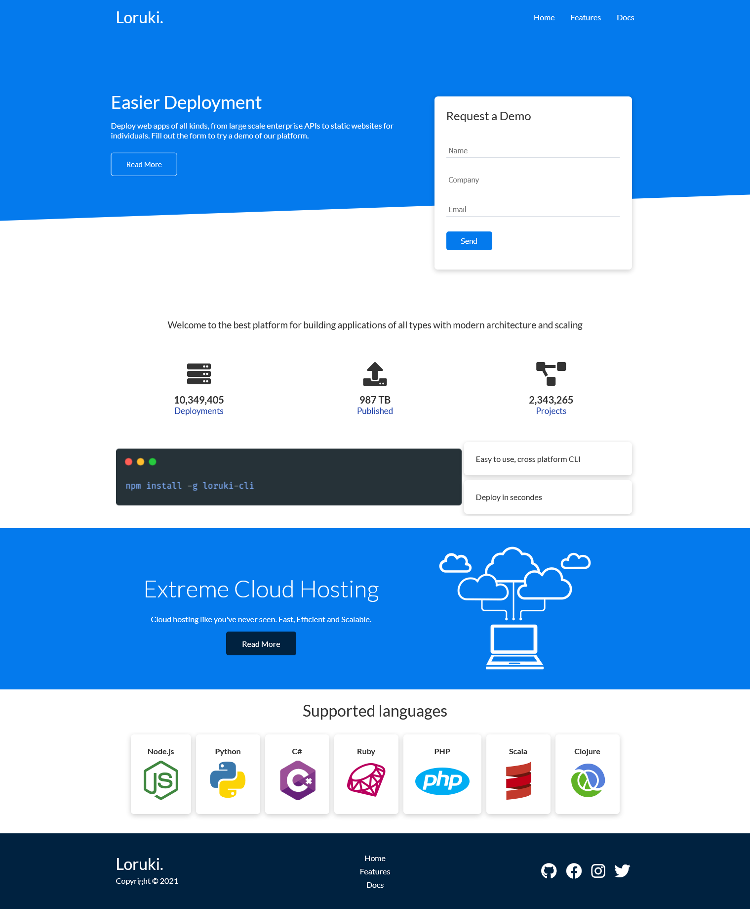
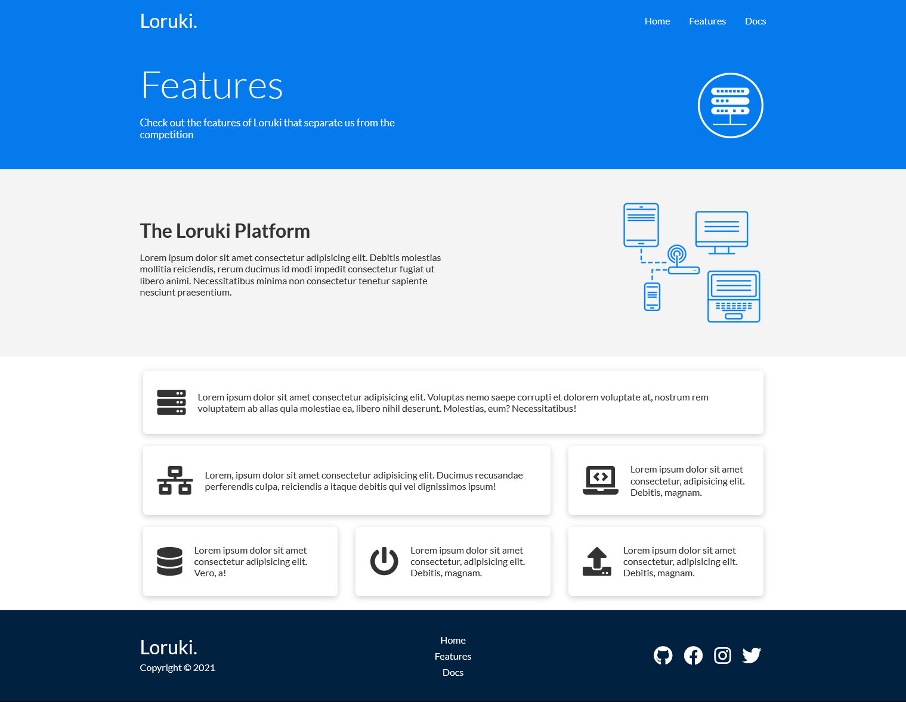
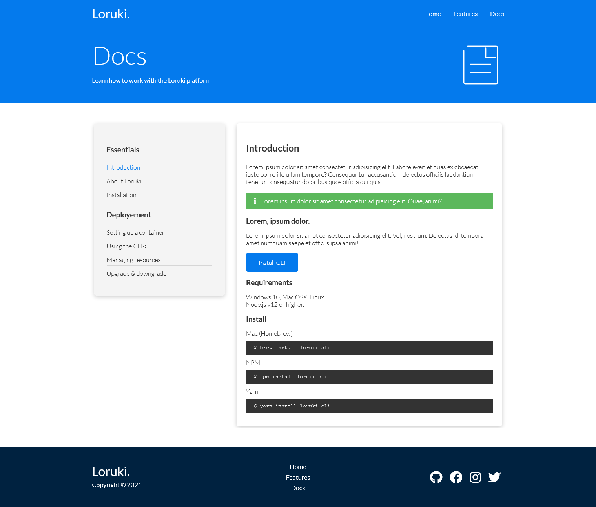

# Loruki - Hosting Website

This is a try to create a user interface of a Hosting Website.

## Table of contents

- [Overview](#overview)
  - [The goal](#the-goal)
  - [Screenshot](#screenshot)
  - [Links](#links)
- [My process](#my-process)
  - [Built with](#built-with)

## Overview

### The goal

Users should be able to:

- Fill the form
- Interact with the different elements
- View the optimal layout depending on their device's screen size
- Brows the different pages of the website

### Screenshot

### Links

- Live Site URL: [https://bnkaziz.github.io/loruki-hosting-website](https://bnkaziz.github.io/loruki-hosting-website)

## My process

### Built with

- Semantic HTML5 markup
- CSS custom properties
- Flexbox
- Grid
